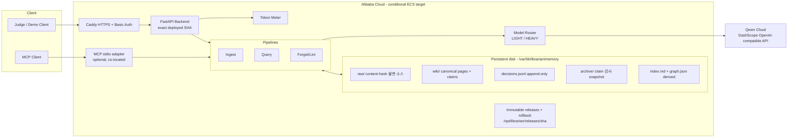

# Architecture — AI-DLC Construction 산출물

> Librarian: 기억을 유지보수하는 MemoryAgent (Track 1)

## 1. 시스템 개요



## 2. 컴포넌트 설계

### 2.1 Model Router (NFR-3)
| 역할 | 모델 계열 | 용도 |
|---|---|---|
| LIGHT | qwen-flash | claim extraction, query draft, lightweight classification |
| HEAVY | qwen-plus-2025-07-28 (live gate 전제) | 모순 판정, 교차 갱신 diff, 최종 답변 합성 |

라우팅 규칙은 config로 외부화 → Free Tier/바우처 전환 시 코드 무변경.

### 2.2 Memory Store — canonical과 derived 분리

- `raw/`: `<source-slug>--<sha256>.md` 불변 원문. 같은 source ID의 revision도 덮어쓰지 않는다.
- `wiki/*.md`: canonical memory. frontmatter의 `claims[]`가 원자적 사실과 lifecycle state를 소유한다.
- `decisions.jsonl`: creation/provenance/transition 근거를 append-only 기록한다.
- `.pending-transition.json`: canonical page write와 ledger append 사이 crash를
  idempotent하게 완료하는 transition outbox다.
- `.pending-ingest.json`: canonical mutation 전에 affected key, incoming claim,
  기존 claim snapshot을 고정한다. 중단 시 기존 state를 복원한 뒤 원자적으로
  판정할 수 없는 current conflict만 `disputed`로 봉쇄한다.
- `.memory.lock`: memory root 단위 OS file lock이다. process-local `RLock`과 함께
  REST/MCP 또는 여러 worker의 read-modify-write를 직렬화한다.
- `index.md`, `graph.json`: wiki에서 언제든 재생성 가능한 projection이다. graph는 claim key,
  lexical term, claim location, future-effective schedule을 포함한다.
- `archive/claims/`: 명시적으로 archived 된 claim의 감사 snapshot. 페이지 전체 자동 archive는 금지한다.

Claim 비교 키는 `scope::subject::predicate`이며 상태는 `active`, `disputed`,
`superseded`, `archived`다. source/evidence/supersedes를 보존하고 status만 lifecycle
validator를 통해 바꾼다.

### 2.3 Ingest 파이프라인 (FR-1)
1. raw source를 content hash 경로에 저장한다.
2. LIGHT가 exact evidence span을 포함한 atomic claim JSON을 추출한다.
3. graph claim index에서 영향받은 동일 key 페이지만 찾는다.
4. exact duplicate/provenance, scope, explicit replacement/effective time을 deterministic gate가 처리한다.
5. 애매한 충돌만 HEAVY가 `supports|contradicts|supersedes|unresolved`를 반환한다.
6. evidence allow-list와 state-machine validator가 승인한 전이만 canonical page에 원자적으로 쓴다.
7. affected-key ingest journal과 transition outbox를 먼저 고정하고 decision receipt
   append까지 완료한 뒤 commit phase를 기록하고 제거한다.
8. graph/index projection을 재생성하며 interrupted projection marker는 다음 query/lint가 복구한다.

### 2.4 Query 파이프라인 (FR-2) — surgical context (CodeGraph 개념)
1. `graph.json` metadata만 읽어 title/summary/tags/active key를 점수화한다.
2. 상위 K개 slug만 실제 Markdown page로 읽는다(REST/MCP K<=10).
3. active claim은 context에 넣고 disputed는 충돌 표식으로 제한한다. superseded,
   archived, 아직 효력이 없는 claim은 제외한다.
   효력 도래 transition의 canonical materialization은 ingest/lint maintenance 또는
   evaluation checkpoint에서 query 전에 수행하며 query 자체는 page state를 쓰지 않는다.
4. LIGHT 구조 응답의 fact/claim/page/evidence 결속을 deterministic validator가 확인한다.
5. citation 정제 후 근거가 없으면 HEAVY로 승격하고, 재실패하면 fail-closed abstain한다.
6. retrieval/status/context/model token trace를 `RunLedger`에 기록한다.

### 2.5 Forget/Lint 엔진 (FR-3) — 차별화 코어
- ingest에서 superseded 된 claim은 즉시 query context에서 빠지지만 원문과 claim은 남는다.
- lint는 O(n²) page/숫자 비교를 하지 않는다. projection drift, invalid claim, audit gap,
  disputed key group만 검사한다.
- HEAVY disputed arbitration도 supplied claim/source/span allow-list를 통과해야 한다.
- HEAVY `supersedes`는 winner 자신이 소유한 source/span이 winner key/value와
  replacement/effective 근거를 동시에 지지해야 한다.
- unresolved는 계속 disputed이고, 전체 페이지를 삭제·이동하지 않는다.
- `superseded → active` rollback과 crash 후 missing creation receipt 복구가 idempotent하다.

### 2.6 MCP Server (FR-4.2)
선택적 stdio 인터페이스다. 실제 툴 시그니처는
`memory_ingest(source_id, text)`, `memory_query(question, top_k=5)`,
`memory_lint(apply_archive=True)`, `memory_stats()`다. 각 툴은 HTTP API를
호출하지 않고 FastAPI와 동일한 in-process ingest/query/lint/store 구현을 얇게
호출하므로 핵심 lifecycle 로직을 복제하지 않는다.

## 3. 기술 스택

| 레이어 | 선택 | 이유 |
|---|---|---|
| 런타임 | Python 3.12+ / uv | lockfile 기반 재현 실행 |
| API | FastAPI | 경량, OpenAPI 자동 문서 |
| LLM | OpenAI SDK → dashscope-intl compatible-mode | 공식 권장 경로 |
| 저장 | 파일시스템(마크다운) + graph.json | DB 불필요 = 배포 단순 + 서사 일치 |
| 배포 | Alibaba Cloud ECS trial candidate | 현재 파일 기반 persistence와 Workbench 증빙을 최소 변경으로 보존. 계정 자격/활성화는 별도 승인 전까지 미확정 |
| MCP | mcp Python SDK | optional integration; 공식 Track 1 필수 계약 아님 |

## 4. 디렉터리 구조 (목표)

```
├── src/librarian/
│   ├── main.py            # FastAPI 엔트리
│   ├── llm.py             # Model Router + DashScope 클라이언트
│   ├── claims.py          # claim contracts, IDs, state-machine validator
│   ├── store.py           # Memory Store (페이지/인덱스/로그/그래프)
│   ├── ingest.py          # FR-1
│   ├── query.py           # FR-2
│   ├── forget.py          # FR-3 Lint 엔진
│   ├── meter.py           # 토큰 계측
│   └── mcp_server.py      # FR-4.2
├── eval/                  # frozen dev/holdout, B0/B1/B2/C, deterministic scorer
├── memory/                # raw/ wiki/ archive/ (런타임 데이터)
├── deploy/                # Alibaba Cloud 배포 스크립트 (제출 증빙)
├── bench/                 # legacy token/format smoke benchmark
├── aidlc-docs/            # 본 설계 문서 (AI-DLC 산출물)
└── wiki/                  # 해커톤 지식베이스 (개발용, 프로덕트와 별개)
```

## 5. 핵심 설계 결정 (ADR 요약)

- ADR-1: 벡터DB 미사용 — index+graph 탐색이 "구조화 기억" 서사와 일치하고 배포·비용 단순화.
  트레이드오프: 초대형 코퍼스 미지원 (해커톤 스코프에서 무해).
- ADR-2: 망각 = claim state transition — superseded는 recall에서 제외하되 source/claim/decision을 보존한다.
- ADR-3: 모델 이원화 — Free Tier 예산 방어 + "성능 최적화" 심사 항목 어필.
- ADR-4: 파일 기반 저장 — application release와 persistent memory root를 분리하고,
  원문/claim/decision receipt로 기억의 버전과 근거를 보존한다.
- ADR-5: `meter.py`는 token, latency, route, retrieval trace를 append-only RunLedger에 기록한다.
- ADR-6: versioned static prompt prefix와 strict JSON contract를 사용하고 동적 context를 suffix에 둔다.
- ADR-7: model output은 제안일 뿐 — deterministic evidence/lifecycle validator만 memory state를 변경한다.
- ADR-8: 평가 gold와 runner를 물리적으로 분리하고 Qwen-as-a-judge를 사용하지 않는다.
- ADR-9: primary comparison은 내장 B0/B1/B2와 fingerprint가 고정된 실제 Librarian C를
  동일 atomic extraction/answer/top-K/context 조건에서 비교한다. 별도 C-only
  production-conformance lane은 baseline delta 없이 lifecycle 자체를 검증한다.
- ADR-10: production-conformance는 transition ledger의 strict schema, visible-source
  evidence binding, checkpoint prefix append-only, FSM replay=canonical state를 AND gate로 둔다.
- ADR-11: exact-SHA immutable release만 교체하고 persistent memory는 rollback에서도 유지한다.
- ADR-12: structural, live-Qwen, deployed-persistence, private-promotion 증명을 별도 AND gate로 유지한다.
