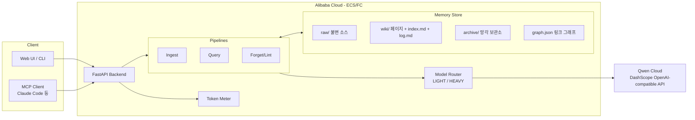

# Architecture — AI-DLC Construction 산출물

> Librarian: 기억을 유지보수하는 MemoryAgent (Track 1)

## 1. 시스템 개요



## 2. 컴포넌트 설계

### 2.1 Model Router (NFR-3)
| 역할 | 모델 계열 | 용도 |
|---|---|---|
| LIGHT | qwen-flash / qwen-turbo | 요약, 분류, 링크 후보 추출, 인덱스 문구 |
| HEAVY | qwen-plus / qwen-max | 모순 판정, 교차 갱신 diff, 최종 답변 합성 |

라우팅 규칙은 config로 외부화 → Free Tier/바우처 전환 시 코드 무변경.

### 2.2 Memory Store — 3계층 (LLM Wiki 개념)
- raw/: 불변 원본. 에이전트는 읽기만.
- wiki/: 에이전트가 소유하는 마크다운. frontmatter(tags, updated, sources, links)로
  경량 그래프 구성 → graph.json으로 직렬화 (Graphify 개념).
- archive/: 망각된 페이지 + 망각 근거. 삭제하지 않는다 (감사 가능성).

### 2.3 Ingest 파이프라인 (FR-1)
1. raw/ 저장 → LIGHT 요약 → 신규 페이지 작성
2. index.md에서 관련 페이지 후보 탐색 (전체 스캔 금지)
3. HEAVY가 후보 페이지별 갱신 diff 생성 → 적용
4. 모순 감지 시 conflict 플래그 → lint 큐 등록
5. index.md / log.md 갱신

### 2.4 Query 파이프라인 (FR-2) — surgical context (CodeGraph 개념)
1. index.md + graph.json 탐색으로 관련 페이지 K개 선별 (기본 K<=5)
2. 선별 페이지만 컨텍스트 주입 → HEAVY 답변 + 인용
3. Token Meter가 in/out 기록 → naive full-read 대비 절감률 산출 근거

### 2.5 Forget/Lint 엔진 (FR-3) — 차별화 코어
- stale: 페이지 주장 vs 이후 ingest된 소스 대조 (LIGHT 스크리닝 → HEAVY 판정)
- conflict: 플래그된 쌍을 HEAVY가 판정 → 승자 반영, 패자 archive
- orphan: graph.json에서 inbound 0 페이지 → 병합 제안 또는 archive
- 모든 망각은 log.md에 근거와 함께 기록

### 2.6 MCP Server (FR-4.2)
stdio 기반. 툴: memory_ingest(source), memory_query(question), memory_lint().
백엔드 API를 얇게 래핑 → 로직 중복 없음.

## 3. 기술 스택

| 레이어 | 선택 | 이유 |
|---|---|---|
| 런타임 | Python 3.11+ / uv | 속도, DashScope 예제 호환 |
| API | FastAPI | 경량, OpenAPI 자동 문서 |
| LLM | OpenAI SDK → dashscope-intl compatible-mode | 공식 권장 경로 |
| 저장 | 파일시스템(마크다운) + graph.json | DB 불필요 = 배포 단순 + 서사 일치 |
| 배포 | Alibaba Cloud ECS (또는 FC) | 제출 증빙 요건 |
| MCP | mcp Python SDK | 심사 가점 |

## 4. 디렉터리 구조 (목표)

```
├── src/librarian/
│   ├── main.py            # FastAPI 엔트리
│   ├── llm.py             # Model Router + DashScope 클라이언트
│   ├── store.py           # Memory Store (페이지/인덱스/로그/그래프)
│   ├── ingest.py          # FR-1
│   ├── query.py           # FR-2
│   ├── forget.py          # FR-3 Lint 엔진
│   ├── meter.py           # 토큰 계측
│   └── mcp_server.py      # FR-4.2
├── memory/                # raw/ wiki/ archive/ (런타임 데이터)
├── deploy/                # Alibaba Cloud 배포 스크립트 (제출 증빙)
├── bench/                 # 토큰 절감 벤치마크
├── aidlc-docs/            # 본 설계 문서 (AI-DLC 산출물)
└── wiki/                  # 해커톤 지식베이스 (개발용, 프로덕트와 별개)
```

## 5. 핵심 설계 결정 (ADR 요약)

- ADR-1: 벡터DB 미사용 — index+graph 탐색이 "구조화 기억" 서사와 일치하고 배포·비용 단순화.
  트레이드오프: 초대형 코퍼스 미지원 (해커톤 스코프에서 무해).
- ADR-2: 망각 = archive 이동 — 삭제 대비 감사 가능, 데모에서 근거 로그를 보여줄 수 있음.
- ADR-3: 모델 이원화 — Free Tier 예산 방어 + "성능 최적화" 심사 항목 어필.
- ADR-4: 파일 기반 저장 — git 히스토리가 곧 기억의 버전 관리 (LLM Wiki 원문 아이디어 계승).
